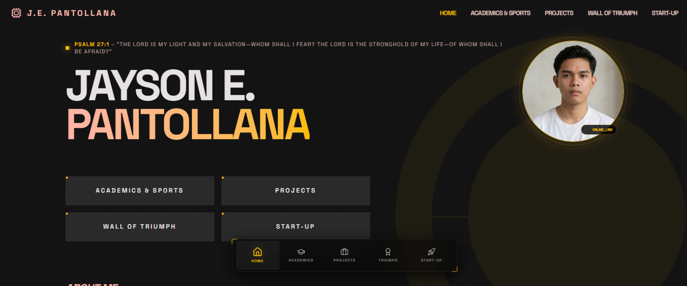

<div align="center">


# 🚀 My Personal Portfolio

**Student · Researcher · Vibecoder · Athlete**

[](https://www.facebook.com/jaysonpantoallana)
[](https://github.com/jaysonpantollana)
[](https://mail.google.com/mail/?view=cm&to=jaysonpantollanaj3@gmail.com)
[](https://www.google.com/maps/place/8%C2%B015'28.5%22N+124%C2%B015'58.8%22E/@8.2579123,124.2656953,19z/data=!3m1!4b1!4m4!3m3!8m2!3d8.257911!4d124.266339?entry=ttu&g_ep=EgoyMDI2MDQyNi4wIKXMDSoASAFQAw%3D%3D)

</div>

---

## 📖 About

This is my personal portfolio website a digital space that captures my journey as a student, researcher, innovator, and athlete. From building award-winning drones and IoT systems in high school to launching start-ups and competing on national and international stages, this portfolio is a living record of my work and aspirations.

Built with a modern, performant stack and featuring 3D animations, smooth scroll interactions, and a sleek dark aesthetic.

---

## ✨ Features

- **3D Interactive Visuals** powered by Three.js & React Three Fiber
- **Smooth Animations** with GSAP and Framer Motion
- **Responsive Design** across all screen sizes via Tailwind CSS v4
- **Multi-page Routing** with React Router v7
- **AI-assisted Development** originally scaffolded in Google AI Studio (Gemini)
- **Sections:** Hero · Projects · Start-ups · Awards · Academics · Contact

---

## 🛠️ "The Tech Stack"


---

## 🔬 Featured Projects

| Project | Description |
|---|---|
| **Dr. One** | Semi-autonomous environmental quality monitoring drone with predictive AI analytics, tether system, and real-time monitoring |
| **Aqua Guardian** | Drone-based semi-automatic water sampling system with tether system and ground computer |
| **Sensobot** | IoT-based water quality monitoring system with navigation robot capabilities |
| **Aqua-lert** | IoT-based water leak detector for residential and industrial use |

---

## 🏃 Run Locally

**Prerequisites:** [Node.js](https://nodejs.org/) (v18 or higher)

```bash
# 1. Clone the repository
git clone https://github.com/jaysonpantollana/My_Portfolio.git
cd My_Portfolio

# 2. Install dependencies
npm install

# 3. Set up environment variables
#    Create a .env.local file and add your Gemini API key:
#    GEMINI_API_KEY=your_api_key_here

# 4. Start the development server
npm run dev
```

The app will be available at **http://localhost:3000**

### Other Commands

```bash
npm run build    # Build for production
npm run preview  # Preview the production build
npm run lint     # Type-check with TypeScript
```

---


## 🤖 Run in Google AI Studio

You can explore and run this app directly in **Google AI Studio** — Click the link below.


👉 **[View Portfolio:](https://ais-dev-bcu4tt6yjeozowc27s7smj-749953598123.asia-southeast1.run.app)**


---


## 📬 Contact

Want to collaborate, connect, or just say hi? Reach out via the contact section on the portfolio, or find me on GitHub at [@jaysonpantollana](https://github.com/jaysonpantollana).

---

<div align="center">

*"Trust in the Lord with all your heart and lean not on your own understanding." — Proverbs 3:5*

Made with ❤️ by Jayson Pantollana

</div>
